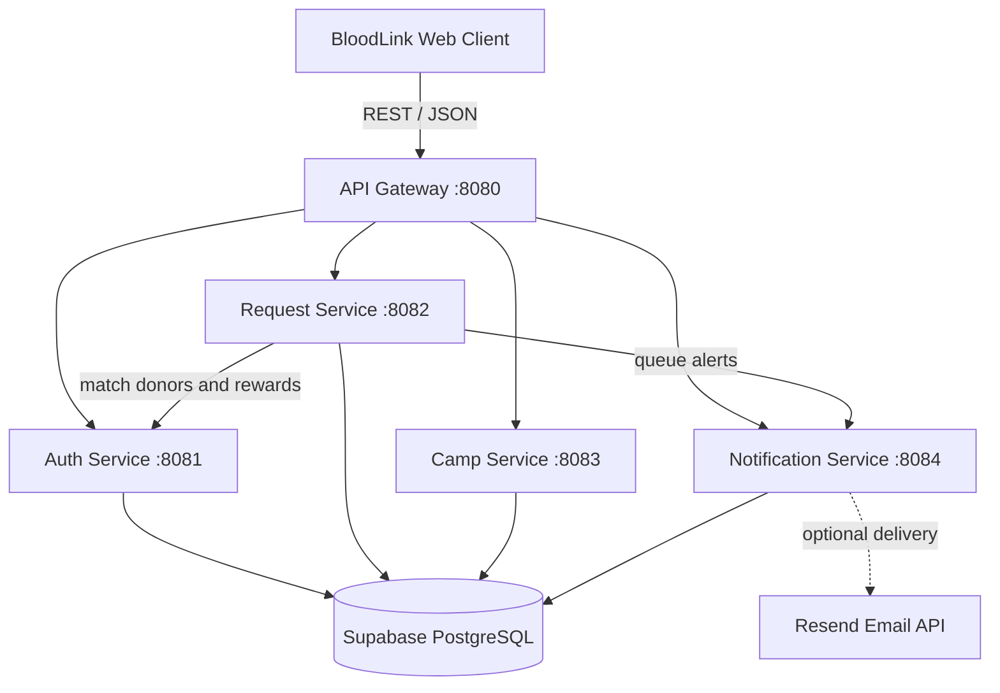

# BloodLink Backend

A Spring Boot microservices backend for **BloodLink**, a blood-donation platform that connects patients, donors, hospitals, and donation-camp organizers.

[](https://openjdk.org/projects/jdk/17/)
[](https://spring.io/projects/spring-boot)
[](https://supabase.com/)
[](https://maven.apache.org/)

## Overview

BloodLink provides a single REST API for:

- User registration, login, and JWT-based authentication
- Donor and patient profile management
- Blood-request creation, filtering, tracking, and cancellation
- Donor matching by blood type and district
- Donor acceptance or rejection of requests
- Donation-camp discovery and creation
- Reward-point updates
- Queued email/SMS notification records

## Architecture

The project uses a **microservices architecture**. Clients call the API Gateway, which forwards requests to independently focused Spring Boot services. The Request Service coordinates donor matching and notification creation, while the domain services persist data in Supabase PostgreSQL.



## Services

| Module | Port | Responsibility |
| --- | ---: | --- |
| `api-gateway` | `8080` | Public entry point, CORS handling, and routing to internal services |
| `auth-service` | `8081` | Authentication, JWTs, user/donor/patient profiles, donor matching, and rewards |
| `request-service` | `8082` | Blood-request lifecycle, donor responses, matching coordination, and alert triggers |
| `camp-service` | `8083` | Donation-camp listing, filtering, and creation |
| `notification-service` | `8084` | Notification queue persistence and optional Resend email delivery |
| `common` | — | Shared code used by the service modules |

> The frontend should use `http://localhost:8080` as its API base URL.

## Tech Stack

- Java 17
- Spring Boot 3.3.5
- Spring Web and Spring Data JPA
- Spring Security
- JWT with JJWT 0.12.6
- PostgreSQL hosted on Supabase
- Maven multi-module build
- Resend API integration for email notifications
- Postman for API testing

## Project Structure

```text
BloodLink-Backend/
├── api-gateway/
├── auth-service/
├── request-service/
├── camp-service/
├── notification-service/
├── common/
├── database/
│   └── supabase-schema.sql
├── BloodLink-API.postman_collection.json
├── .env.example
└── pom.xml
```

## Prerequisites

- JDK 17 or newer
- Maven 3.9+
- A Supabase project or PostgreSQL database
- Postman (optional, for testing)

## Getting Started

### 1. Clone the repository

```bash
git clone https://github.com/Tira2003/BloodLink-Backend.git
cd BloodLink-Backend
```

### 2. Create the database schema

1. Open the Supabase SQL Editor.
2. Run [`database/supabase-schema.sql`](database/supabase-schema.sql).
3. Copy the database connection details from **Project Settings → Database**.

### 3. Configure environment variables

Copy the example file:

```bash
cp .env.example .env
```

On Windows PowerShell:

```powershell
Copy-Item .env.example .env
```

Update `.env` with your own values:

```dotenv
SUPABASE_DB_URL=jdbc:postgresql://YOUR-HOST:5432/postgres?sslmode=require
SUPABASE_DB_USER=YOUR-DATABASE-USER
SUPABASE_DB_PASSWORD=YOUR-DATABASE-PASSWORD
JWT_SECRET=replace-with-a-long-random-secret-at-least-32-characters
JWT_EXPIRATION_MINUTES=1440

AUTH_SERVICE_URL=http://localhost:8081
REQUEST_SERVICE_URL=http://localhost:8082
CAMP_SERVICE_URL=http://localhost:8083
NOTIFICATION_SERVICE_URL=http://localhost:8084

# Optional: enables email delivery through Resend
RESEND_API_KEY=
```

Never commit the completed `.env` file or real credentials.

### 4. Build all modules

```bash
mvn clean package
```

### 5. Start the services

Open a separate terminal for each command:

```bash
mvn -pl auth-service spring-boot:run
mvn -pl request-service spring-boot:run
mvn -pl camp-service spring-boot:run
mvn -pl notification-service spring-boot:run
mvn -pl api-gateway spring-boot:run
```

The API Gateway becomes available at `http://localhost:8080`.

## Main API Endpoints

Most protected endpoints require:

```http
Authorization: Bearer <JWT_TOKEN>
```

### Authentication and Profiles

| Method | Endpoint | Description |
| --- | --- | --- |
| `POST` | `/api/auth/register` | Register a user |
| `POST` | `/api/auth/login` | Authenticate and receive a JWT |
| `GET` | `/api/auth/me` | Get the authenticated user |
| `POST` | `/patient/profile` | Create a patient profile |
| `GET` | `/api/donors/me` | Get the current donor profile |
| `PUT` | `/api/donors/me` | Update the current donor profile |
| `GET` | `/api/donors/me/donations` | Get the donor's donation history |

### Blood Requests

| Method | Endpoint | Description |
| --- | --- | --- |
| `GET` | `/api/requests` | List requests; supports status, blood-type, and district filters |
| `GET` | `/api/requests/{id}` | Get one request |
| `POST` | `/api/requests` | Create a blood request |
| `GET` | `/api/requests/active` | Get the requester's active requests |
| `GET` | `/api/requests/history` | Get the requester's request history |
| `PUT` | `/api/requests/{id}/cancel` | Cancel a request |
| `POST` | `/api/requests/{id}/respond` | Accept or reject a donor request |

### Donation Camps

| Method | Endpoint | Description |
| --- | --- | --- |
| `GET` | `/api/camps` | List camps; supports district and upcoming filters |
| `POST` | `/api/camps` | Create a donation camp |

## API Testing

Import [`BloodLink-API.postman_collection.json`](BloodLink-API.postman_collection.json) into Postman.

The collection provides:

- `baseUrl` set to `http://localhost:8080`
- Register and login examples
- Automatic JWT capture after login
- Profile requests
- Blood-request workflows
- Donation-camp requests

Run the services first, execute **Register User**, then **Login User**. The collection stores the returned token for protected requests.

## Request Flow

1. The client sends a request to the API Gateway.
2. The gateway routes it to the responsible service.
3. Protected services validate the JWT.
4. A new blood request is matched against donors by blood type and district.
5. The Request Service asks the Notification Service to queue alerts.
6. Donor responses and reward updates are persisted in PostgreSQL.

## Security Notes

- Use a strong, unique JWT secret of at least 32 characters.
- Keep Supabase and Resend credentials outside source control.
- Use HTTPS and restricted CORS origins in production.
- Rotate any exposed credentials immediately.
- The current configuration is intended for local development and should be hardened before production deployment.

## Contributing

1. Fork the repository.
2. Create a feature branch.
3. Make and test your changes.
4. Commit with a clear message.
5. Open a pull request describing the change.

## License

No license file is currently included. Add a license before distributing or reusing the project outside its intended scope.
